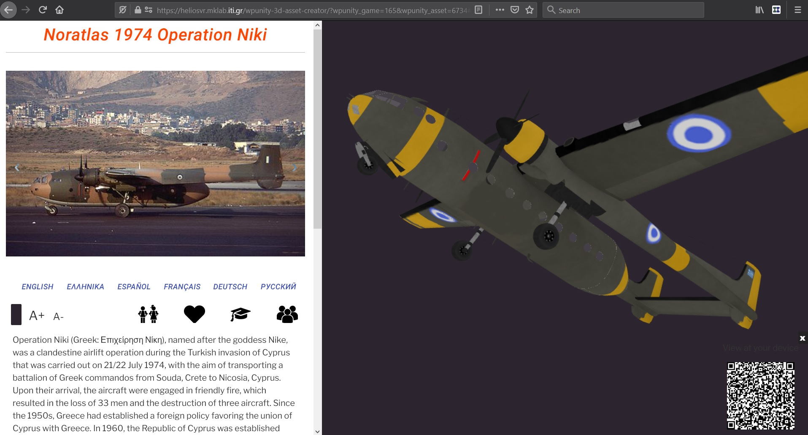
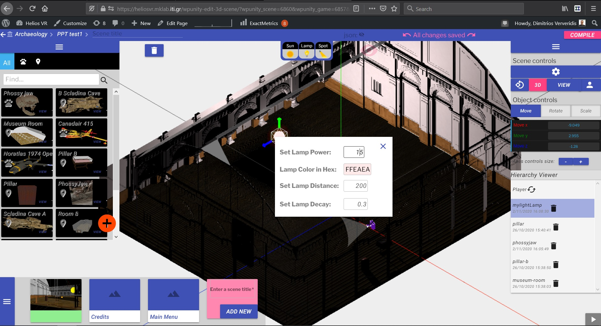

> ### NOTE:

> ### This repository is not maintained any more. The software is rebranded as VRodos (but it is still open source) under:
> https://github.com/VRodos/VRodos 

A Wordpress plugin for uploading 3D assets and assembling scenes through a web interface. 

##Basic Interfaces

Asset Uploader and Previewer

Scene synthesis

### What is this repository for? ###

* This code helps someone to build a Unity3D game remotely without writting any code. It exploits the pros of Wordpress to allow drag'n'drop actions to make a scene and play it. 

v2.0 Latest version 1_1_2020

- Lights have been added (Spot, Directional, Sphere)
- FBX format is added.
- Animation is supported
- PDB format is added
- GLB format is on the go

v1.0 Production 9_2018

### Do you have a demo?

Yes it is : https://heliosvr.mklab.iti.gr

You will need the Firefox Web browser to access the tool. At least 2GBs of RAM should be available in your machine otherwise the models can not be loaded. 

It requires sign up and sign in.

### Archaeologists: Do you have a video of the demo?

Yes, it is: https://www.youtube.com/watch?v=BbBOKCBryvU&t=33s

and the compiled game output in Unity3D: https://www.youtube.com/watch?v=qKPqvNrge9U

### Instructions for archaeologists?

You can advise the following document : https://www.dropbox.com/s/q0ak9asos7bjy85/DigiArtUsageScenarios.docx?dl=0

If you want to make your own asset you can use the guidelines in this wiki : https://github.com/DigiArt-project/wordpressunity3deditor/wiki/3D-Models-specifications

Let us know if you have any diffuculties or you found any bugs

### Instructions to make a new instance for the whole tool ###

This section is for web admins that want to make a story telling engine in their own server. Below are the instructions. 

You need to have a WordPress site (4.7 or later) and Unity3D should be installed according to the following instructions:

A Server operating system with Ubuntu 16 or Windows 10 is required. The server software XAMPP with php 5.6 for Ubuntu or Windows should be used which is public available . WordPress 4.5 should be also installed which is also public available. XAMPP and WordPress are not developed in DigiArt and therefore there is no testing plan for them here. However, they should be installed and tested according to their vendors. If any modifications on their files are required to comply with DigiArt components, it will be explicitly stated.

Download Unity3D free version 2018.1 or later for Windows from Unity3D website. Install, run and activate it in the windows that will appear. The GUI of Unity3D should be loaded, otherwise an error will be prompted.

Then you download the whole repository as a zip and install it from plugins->add new->upload zip

### Contribution guidelines ###

* Writing tests: To appear
* Code review: To appear
* Other guidelines: Fill in the electronic questionnaire for the evaluation feedback:    https://docs.google.com/forms/d/e/1FAIpQLSfgh7draz7sJ5lx5VLUUtE8rhud4dt9d_ZbqJuW4qaKlCJJaQ/viewform?usp=sf_link

### Peer calls ###

A visitor to an artifact can speak with an expert through node.js peer-calls. It is installed in an iframe in artifact page.
It starts in server in the peer-calls folder with
* sudo npm run build
* sudo npm start  

### Who do I talk to? ###

* I am coordinating and contributing to this repository: Dimitrios Ververidis, ververid [at] iti.gr, jimver04 [at] gmail.com
